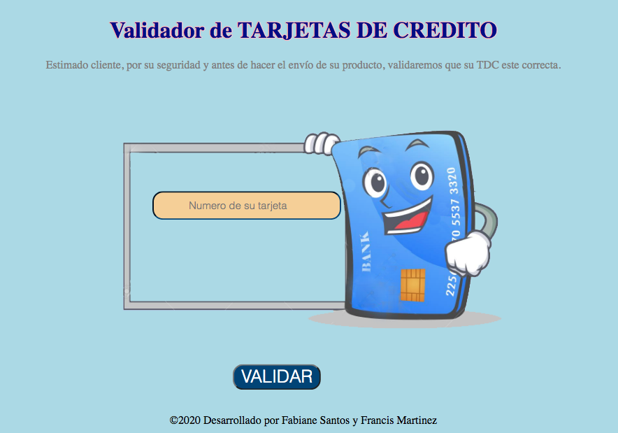
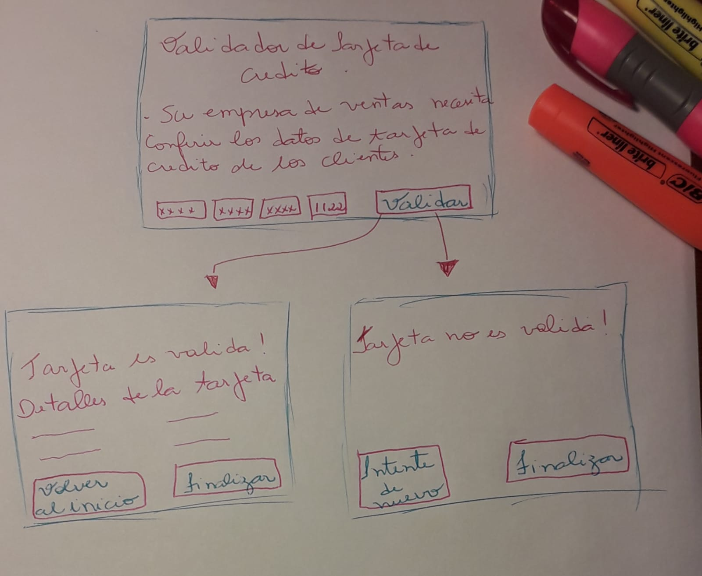
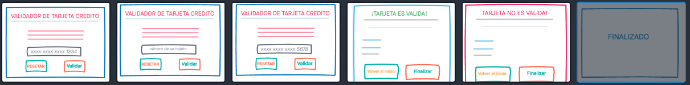
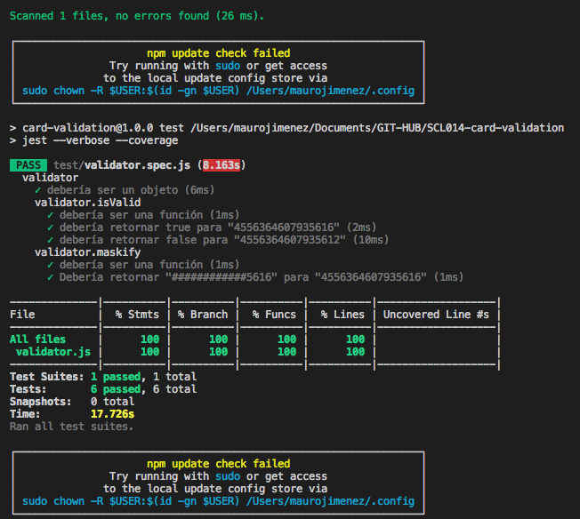

# ¡LLAMEYA! 
## Credit Car Validator

[link para proyecto en gh-pages/Fabiane](https://fabianesantos.github.io/SCL014-card-validation/src/index.html)

## Resumen:

Desarrollar un producto, donde sea posíble verificar los numeros de tarjetas de credito, fornecidos por un cliente al realizar una compra de algún producto via teléfono.

## Objetivos:

Somos del departamento de desarrollo de tecnologia de la empresa **¡LLAMEYA!**

Unos de los canales de venta con mayor ganancia, es hecho via telemarketing.

Fue solicitado a nuestro departamento crear un software donde los responsables por las televentas, puedan conferir si los numeros de las tarjetas que son solicitados para concretar la venta, son validos, antes de finalizar la compra del cliente.

Con eso, el proceso será optimizado. Dónde se podrá constatar si los datos de la tarjeta están correctos, antes de finalizar la compra.

## Investigación UX:

Muchas veces los clientes que comparam via teléfono son personas mayores, com alguna dificuldad visual o que no se manejam con computadores e la internet.

A la vez, muchos operadores de televentas no logran entender los numeros dichos por los cliente, y conferir los numeros al principio evitará un mayor transtorno.

El validador de tarjetas será utilizado por los atendentes del televentas, que antes mismo de confirmar los productos, podrán verificar si el numero de la tarjeta está correcto.

## Ideación:

Después de tener los primeros datos del proyecto, fue idealizado , por medios de sketchs hechos con lapis y papel.

<!--   -->

## Feedback de compañeros:

Con el sketcher en manos, nos reunimos con otros compañeros y recibimos un primer **feedback**, donde constatamos que debíamos enfocarnos en crear algo sencillo y funcional.

## Prototipado:

Partimos a dibujar en el app INVISION, donde fue posible mejorar algunos puntos del sketch y lanzarnos al prototipo.

[click para ver el prototipo de alta fidelidad ](https://fabiane291316.invisionapp.com/public/share/QV176G8YJ6#screens/478596646)

Después de finalizado, el **Validador de Tajetas**, será utizado en una interface para desktop, de fácil manipulación, y además tendrá un "script", dónde la persona responsable por la venta comunicará al cliente.

## Objetivos de Aprendizado:

### UX

- Diseñar la aplicación pensando y entendiendo al usuario.
- Crear prototipos para obtener feedback e iterar.

### HTML y CSS

- Uso correcto de HTML semántico.
- Uso de selectores de CSS.

### DOM

- Uso de selectores del DOM.
- Manejo de eventos del DOM.
- Manipulación dinámica del DOM.

### Javascript

- Manipulación de strings.
- Uso de condicionales (if-else ).
- Uso de funciones (parámetros | argumentos | valor de retorno).
- Declaración correcta de variables (const & let).
- Uso de ES Modules (import | export).

### Testing

- Test unitarios
  

### Git y GitHub

- Comandos de git (add | commit | pull | status | push).
- Manejo de repositorios de GitHub (clone | fork | gh-pages).

### Buenas prácticas de desarrollo

- Organizar y dividir el código en módulos.
- Organizar nuestras informaciones, sprint, dailys, etc. Con el **TRELLO**
- Uso de identificadores descriptivos (Nomenclatura | Semántica).
- Uso de linter para seguir buenas prácticas (ESLINT).

## Autor@s:

  [Fabiane Santos](https://github.com/FabianeSantos?tab=repositories)
  [Francis Martinez](https://github.com/Fran2325)